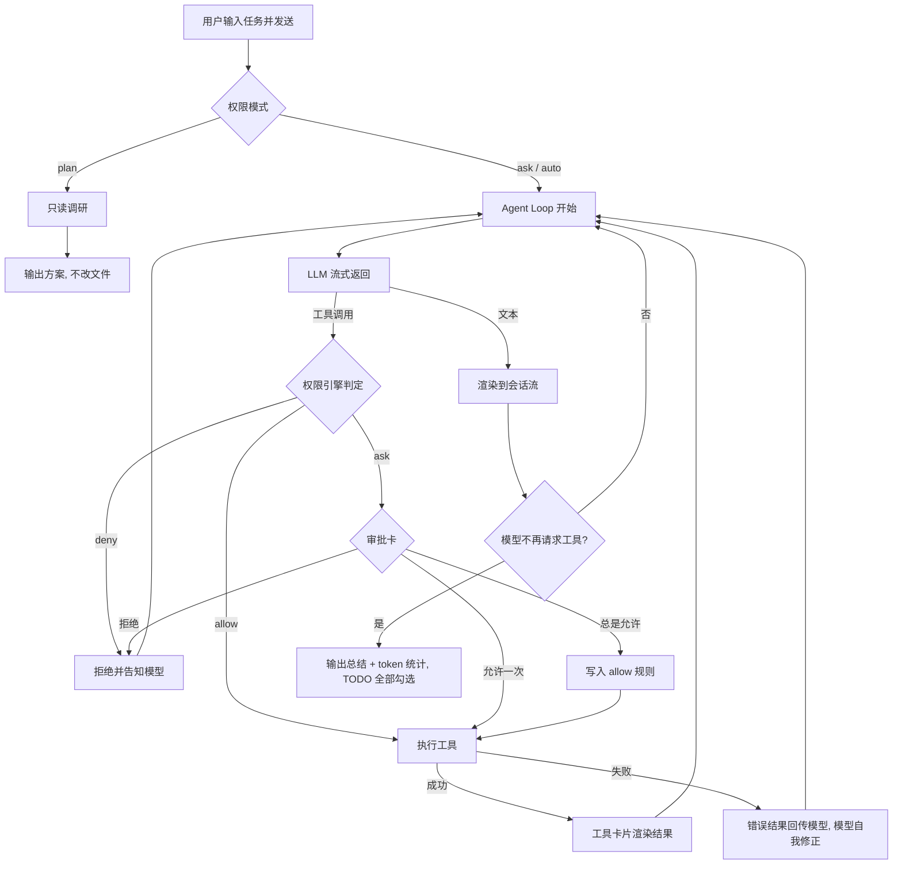

# cyan 产品需求文档（PRD）

| 项目 | 内容 |
| --- | --- |
| 产品名称 | cyan — 桌面端 AI 编程 Agent |
| 版本 | v1.0.0 |
| 形态 | 桌面应用（macOS / Windows / Linux），Rust + Tauri v2 + React + TS + AntD |
| 原型 | `docs/1.0.0/prototype/index.html` |
| 状态 | 待评审 |

## 1. 背景与目标

### 1.1 业务背景

AI 编程 Agent（Codex、Claude Code、Kimi Code 等）已验证"自然语言下达任务 → Agent 自主读写代码、执行命令、逐步完成"的产品形态。但现有工具多为终端 TUI，存在门槛：会话不可视、审批上下文不清晰、文件与变更无法同屏查看、配置依赖手写文件。

cyan 以桌面应用形态提供同等 Agent 能力，用图形界面降低使用门槛，并把"权限与审批"作为核心差异化：Agent 的一切写操作都在用户看得见、拦得住的边界内发生。

### 1.2 目标用户

- 主力：个人开发者 / 小团队工程师，日常需要 AI 辅助完成编码、调试、重构、脚手架搭建。
- 次力：技术负责人，需要约束 Agent 在团队规范内操作（权限规则、deny 清单）。

### 1.3 要解决的问题

- 终端 Agent 工具交互门槛高，会话过程不可视、历史难回溯。
- Agent 自主执行命令存在安全风险，用户需要分级、可配置的放行策略。
- 多项目切换时上下文混乱，需要"项目 = 工作目录"的明确边界。
- Agent 改动缺乏可视化 diff 与一键回滚。

### 1.4 成功指标

| 指标 | 目标（上线 3 个月） |
| --- | --- |
| 任务完成率（用户未打断且评价正向的任务占比） | ≥ 60% |
| 审批卡平均响应时长 | ≤ 10s |
| 周留存 | ≥ 35% |
| 因 Agent 误操作导致的投诉/回滚率 | ≤ 2% |
| 崩溃率 | ≤ 0.5% 会话 |

## 2. 角色与权限

cyan 是**单机桌面应用**，无多账号体系。角色与权限分两个维度：

### 2.1 用户角色

| 角色 | 说明 | 可见范围 |
| --- | --- | --- |
| 本机用户（唯一角色） | 应用使用者，拥有全部功能 | 本机所有项目、会话、配置 |

### 2.2 Agent 操作权限（产品核心）

用户对 Agent 的约束通过「权限模式 + 权限规则」实现：

| 权限模式 | 含义 | 适用场景 |
| --- | --- | --- |
| 计划（plan） | Agent 只读：可 Read/Grep/Glob，禁止 Edit/Write/Bash 写命令，只输出方案 | 调研、评审方案 |
| 询问（ask，默认） | 命中 ask 规则或无规则匹配的危险操作弹出审批卡 | 日常使用 |
| 自动（auto） | 命中 allow 规则的全部放行；deny 仍拦截；其余按 ask 处理 | 可信目录内批量任务 |

权限规则：`工具 + glob 模式 → allow / ask / deny`，自上而下匹配，**deny 永远优先**。

数据权限边界：Agent 的文件读写、Shell 命令、会话归档**全部限定在当前项目目录内**；越界路径（含 `../` 逃逸）直接拒绝并报错。

## 3. 功能总览

| 模块 | 功能点 | 阶段 |
| --- | --- | --- |
| 会话 | 新建 / 切换 / 搜索 / 删除会话；会话按项目归档 | MVP |
| Agent 运行时 | 流式输出；工具调用卡片（Read/Grep/Bash/Edit）；diff 渲染；中断（Esc/停止键） | MVP |
| 权限与审批 | 三种权限模式；审批卡（允许一次 / 总是允许 / 拒绝）；总是允许自动写规则 | MVP |
| 项目 | 指定文件夹为项目；最近项目；新建项目（脚手架模板 + git 初始化） | MVP |
| 文件面板 | 项目文件树；文件预览；@ 引用文件到输入框 | MVP |
| 任务与变更 | TODO 进度展示；变更文件列表；diff 查看；checkpoint 回滚 | MVP |
| 模型配置 | 多模型 CRUD；连接验证；默认模型；启停 | MVP |
| 权限规则 | 规则 CRUD；命中顺序说明 | MVP |
| 设置 | 关于页；通用偏好 | MVP |
| 上下文 | 上下文占用条；超限自动压缩（compaction） | MVP |
| MCP | MCP 服务器 CRUD；启停；连接状态；工具注入 | 增强 |
| 附件 | 图片 / 文件附件上传 | 增强 |
| 会话 | 会话导出（Markdown）；会话分支 fork | 增强 |
| 工作模式 | 多步任务编排（计划 → 分步确认执行） | 增强 |
| 协作 | 账号体系、团队规则下发、云端同步 | 暂不做 |
| 移动端 | iOS / Android | 暂不做 |
| IDE 插件 | VS Code / JetBrains 插件 | 暂不做 |

## 4. 用户故事

- 作为开发者，我希望用自然语言描述 bug 现象，以便 Agent 自动定位、复现、修复并回归验证。
- 作为开发者，我希望 Agent 执行 `git commit` 等危险命令前必须经我确认，以便始终掌握写操作。
- 作为开发者，我希望把常用安全命令（如 `npm test`）加入白名单，以便减少重复审批打扰。
- 作为开发者，我希望随时按 Esc 中断 Agent，以便在它走偏时立即止损。
- 作为开发者，我希望切换项目后会话和文件树随之切换，以便在多个仓库间工作不串场。
- 作为开发者，我希望看到 Agent 改了哪些文件并能一键回滚，以便放心让它动手。
- 作为开发者，我希望从文件树把文件 @ 引用进对话，以便精确指定上下文。
- 作为技术负责人，我希望配置 deny 规则（如 `.env*`、`rm -rf *`），以便从制度上阻断高危操作。
- 作为开发者，我希望自由切换底层模型（Kimi/Claude/GPT/本地模型），以便在成本与能力间取舍。

## 5. 业务流程

### 5.1 主流程：Agent 任务执行

### 5.2 中断流程

用户在运行中点击停止键或按 Esc → 全局 CancellationToken 触发 → 正在执行的工具安全终止、悬置的审批 Promise 以 `abort` 决断、LLM SSE 流关闭 → 会话流插入「已由用户中断」系统消息 → 已产生的文件改动保留在工作区，可回滚。

### 5.3 项目切换流程

点击侧栏「项目」→ 项目弹窗 → 打开文件夹（输入路径 / 选择最近项目）或新建项目（名称 + 目录 + 模板 + git init）→ 校验通过 → 设为当前项目 → 顶栏/侧栏/文件树/空状态联动刷新 → 当前会话插入系统消息记录切换。运行中禁止切换。

### 5.4 异常流程

| 异常 | 处理 |
| --- | --- |
| LLM 请求超时 / 5xx | 指数退避重试 3 次，仍失败则系统消息提示并保留现场，允许重发 |
| 工具执行失败（退出码非 0） | 工具卡标红，stderr 回传模型继续自我修正；连续 3 次同类失败建议用户介入 |
| 上下文接近上限（≥ 90%） | 自动 compaction：总结旧对话、保留用户消息与结论，上下文条回落 |
| MCP 服务器连接失败 | 状态标红「连接失败」，其工具对模型不可见，不影响主流程 |
| 项目目录被外部删除/移动 | 文件树刷新报错，提示重新指定项目 |

## 6. 页面与组件

应用为单窗口三栏布局：

| 区域 | 组件 | 说明 |
| --- | --- | --- |
| 左侧栏（通高） | 品牌行（logo + `‹` 收起）、导航（新工作任务 / 项目 / 技能·MCP / 设置）、会话搜索、会话列表（分组 + emoji 头像 + 悬停删除）、底部用户卡片 + 权限模式提示 | 收起后左上角出现浮动 `›` 展开按钮 |
| 顶栏（右侧内容区上方） | 文件目录开关 🗂、任务与变更开关 📋 | 极简，无品牌元素 |
| 中间会话区 | 空状态（渐变大标题、对话/工作胶囊、推荐项）、消息流（用户气泡 / 助手头像 + 文本 / 工具卡 / 审批卡 / 系统分割线） | 消息流最大宽度居中 |
| 输入区 | 上方：权限模式胶囊 + 上下文占用条；圆角输入卡片：多行输入、附件 ＋、token 统计、模型选择、发送/停止按钮 | Enter 发送、Shift+Enter 换行、Esc 中断 |
| 右侧文件面板 | 面板头（项目名、刷新、收起）、文件树（目录展开/收起、按扩展名图标） | 窄屏（<1100px）自动隐藏 |
| 抽屉（任务与变更） | TODO 清单（pending/doing/done）、变更文件列表（+/- 统计、查看 diff、回滚） | 右侧滑出 |
| 弹窗 | 项目弹窗（打开文件夹 / 新建项目两个 Tab）、设置弹窗（模型配置 / MCP 服务器 / 权限规则 / 关于四个 Tab）、文件预览弹窗、diff 查看弹窗、通用表单弹窗、二次确认弹窗 | 遮罩毛玻璃 |

## 7. 字段规则

### 7.1 模型配置

| 字段 | 类型 | 必填 | 默认 | 校验 / 展示规则 |
| --- | --- | --- | --- | --- |
| name | string | 是 | - | 全局唯一；重复提示「同名模型已存在」 |
| provider | string | 是 | - | 选择框：预设常用服务商（Moonshot Kimi / Anthropic / OpenAI / DeepSeek / 通义千问 / 智谱 GLM / OpenRouter / Ollama 本地）+ 自定义；新增页顶部有快捷按钮，点击一键填充 provider/baseUrl/contextWindow，用户只需再填 API Key |
| baseUrl | string | 是 | 预设自动带出 | 必须匹配 `^https?://`；选预设服务商后自动填充，可手改 |
| apiKey | string | 新增必填 | - | 密码框；编辑时留空表示不修改；存储后掩码展示 `sk-****xxxx` |
| contextWindow | number | 是 | 256000 | 枚举选择：32k / 64k / 131k / 200k / 256k / 400k / 1000k tokens |
| isDefault | boolean | - | false | 全局唯一默认；默认模型不可删除、不可停用 |
| status | enum | - | enabled | enabled / disabled；disabled 不出现在模型选择器 |

### 7.2 MCP 服务器

| 字段 | 类型 | 必填 | 校验 / 展示规则 |
| --- | --- | --- | --- |
| name | string | 是 | 全局唯一 |
| command | string | 是 | 启动命令，支持环境变量占位 |
| status | enum | 系统维护 | connected / error / disabled；error 时展示失败原因 |
| tools | number | 系统维护 | 握手成功后回填工具数；非 connected 展示 `—` |

### 7.3 权限规则

| 字段 | 类型 | 必填 | 校验 / 展示规则 |
| --- | --- | --- | --- |
| tool | enum | 是 | Bash / Edit / Write / Read / Grep / FetchURL / WebSearch |
| pattern | string | 是 | glob 语法，如 `git push *`、`src/**/*.ts` |
| action | enum | 是 | allow（绿）/ ask（橙）/ deny（红） |

### 7.4 项目

| 字段 | 类型 | 必填 | 校验 / 展示规则 |
| --- | --- | --- | --- |
| name | string | 是 | `^[a-zA-Z0-9._-]+$`；同目录下不可重名 |
| path | string | 是 | 打开时须以 `~` 或 `/` 开头且目录存在 |
| template | enum | 新建必填 | empty / node-cli / react-antd / python-pkg |
| gitInit | boolean | - | 默认勾选；checkpoint 回滚依赖 git |
| lastOpened / sessions | - | 系统维护 | 最近项目列表展示用 |

## 8. 状态与操作

### 8.1 会话运行状态机

| 状态 | 含义 | 允许操作 | 迁移 |
| --- | --- | --- | --- |
| idle | 空闲 | 发送任务、切换会话/项目、全部配置操作 | 发送 → running |
| running | Agent 执行中 | 停止（Esc/停止键）；禁止切换会话/项目、禁止再发送 | 完成/出错/中断 → idle |
| waiting_approval | 等待审批（running 子态） | 允许一次 / 总是允许 / 拒绝 / 停止 | 审批后回 running |
| error | 运行出错 | 重发、中断清理 | 重发 → running |

### 8.2 工具调用状态

`running`（执行中，spinner）→ `ok`（绿 Tag）/ `error`（红 Tag）/ `denied`（灰 Tag，规则或用户拒绝）。审批卡状态：`pending → allowed / always / auto / rejected`。

### 8.3 TODO 状态

`pending`（空圈）→ `doing`（蓝点脉冲）→ `done`（绿勾 + 删除线），随 Agent 步骤推进。

### 8.4 禁止操作汇总

- 运行中：禁止切换会话、切换项目、切换权限模式、新建会话、重复发送。
- 默认模型：禁止删除、停用。
- 计划模式：禁止一切写工具与 Bash 写命令（Agent 侧约束 + 前端提示）。

## 9. 通知与反馈

| 场景 | 形式 |
| --- | --- |
| 成功（保存/删除/回滚/切换） | 顶部胶囊 Toast（绿点），2.4s 自动消失 |
| 失败（校验/运行出错） | Toast（红点）；表单字段级红字 + 红边框，保留用户输入 |
| 拦截提醒（运行中切换等） | Toast（黄点） |
| 危险操作（删除会话/删除配置/回滚/删除规则） | 二次确认弹窗，说明后果，红色确认键 |
| 审批 | 暖色审批卡内嵌会话流，不打断阅读位置 |
| 空数据 | 会话列表、模型表格、变更列表均有空态文案与引导 |
| 加载 | 按钮内 spinner（保存验证、MCP 握手、创建项目、刷新文件树）；工具卡执行中 spinner |
| 无权限 | 计划模式横幅提示；deny 命中的工具调用灰 Tag 标注 |

## 10. Button 交互清单

| Button | 位置 | 触发条件 | 交互 | 成功反馈 | 失败反馈 |
| --- | --- | --- | --- | --- | --- |
| `‹` / `›` | 侧栏品牌行 / 收起后左上角 | 总是 | 收起/展开侧栏；移动端联动遮罩 | 侧栏滑动切换 | - |
| `新工作任务` | 侧栏导航 | 非运行中 | 新建会话并激活，展示空状态，聚焦输入框 | 列表顶部出现「新会话」 | 运行中 Toast 拦截 |
| `项目` | 侧栏导航 | 非运行中 | 打开项目弹窗（默认「打开文件夹」Tab） | 弹窗打开 | 运行中 Toast 拦截 |
| `技能 · MCP` | 侧栏导航 | 总是 | 打开设置弹窗并定位 MCP Tab | 弹窗打开 | - |
| `设置` | 侧栏导航 | 总是 | 打开设置弹窗（模型配置 Tab） | 弹窗打开 | - |
| 会话项 | 侧栏列表 | 非运行中 | 切换会话，重渲染消息流与 token 统计 | 选中态白色浮起 | - |
| 会话项 `✕` | 侧栏列表（悬停可见） | 非运行中 | 二次确认后删除会话及归档 | Toast + 列表更新；删除当前会话则回空状态 | 取消则关闭弹窗 |
| `🗂` | 顶栏 | 总是 | 显示/隐藏右侧文件面板 | 面板切换 | - |
| `📋` | 顶栏 | 总是 | 滑出任务与变更抽屉 | 抽屉打开 | - |
| 推荐项 | 空状态 | 总是 | 文案填入输入框并聚焦 | 输入框出现文本 | - |
| `对话/工作` | 空状态胶囊 | 总是 | 对话为默认；工作模式 Toast「敬请期待」 | 胶囊选中态 | - |
| `计划/询问/自动` | 输入区上方 | 非运行中 | 切换权限模式；计划模式显示横幅 | Toast + 侧栏底部文案联动 | 运行中 Toast 拦截 |
| `＋` | 输入卡片 | 总是 | 附件上传（MVP 提示未实现） | Toast 提示 | - |
| 模型选择器 | 输入卡片 | 非运行中 | 切换当前模型 | Toast | - |
| `➤ / ■` | 输入卡片 | 发送需非空文本 | 空闲时发送任务进入 running；运行中变为停止，点击置中断标记 | 消息流推进 | 空文本 Toast；中断后系统消息 |
| 工具卡头 | 消息流 | 总是 | 展开/收起工具输出（代码/diff） | 卡片开合 | - |
| `允许一次` | 审批卡 | pending | 本次放行该工具调用 | 卡片标「已允许」，流程继续 | - |
| `总是允许 X` | 审批卡 | pending | 放行并写入 allow 权限规则 | 卡片标「已加入白名单」+ Toast | - |
| `拒绝` | 审批卡 | pending | 拒绝执行，结果回传模型 | 卡片标「已拒绝」，Agent 改道 | - |
| 抽屉 `✕` / 遮罩 | 抽屉 | 总是 | 关闭抽屉 | 抽屉收起 | - |
| `查看` | 变更列表行 | 总是 | diff 弹窗展示该文件变更 | 弹窗打开 | - |
| `回滚` | 变更列表行 | 非运行中 | 二次确认后恢复该 checkpoint 前状态 | Toast + 列表移除 | 取消则关闭 |
| 目录行 | 文件面板 | 总是 | 展开/收起子树 | 树更新 | - |
| 文件行 | 文件面板 | 总是 | 打开文件预览弹窗 | 弹窗展示内容 | - |
| `⟳` | 文件面板头 | 总是 | 重新读取目录 | spinner 后 Toast | Toast 报错 |
| 面板 `✕` | 文件面板头 | 总是 | 收起文件面板 | 面板隐藏 | - |
| `@ 引用到输入框` | 文件预览弹窗 | 总是 | 插入 `@路径` 到输入框，关闭弹窗并聚焦 | Toast | - |
| 弹窗 `✕` / `取消` | 各弹窗 | 总是 | 关闭弹窗；表单有输入时不强清 | 弹窗关闭 | - |
| `打开` | 项目弹窗 | 路径合法 | 校验路径并设为当前项目，记入最近项目 | Toast + 全量联动 | 校验红字 |
| 最近项目项 | 项目弹窗 | 非当前项目 | 设为当前项目 | 同上 | - |
| `创建并打开` | 项目弹窗 | 校验通过 | spinner 模拟初始化 → 创建项目并切换 | Toast（含模板与 git 信息） | 校验红字 / 重名提示 |
| `＋ 新增模型` | 设置-模型 | 总是 | 打开模型表单弹窗 | 表单打开 | - |
| 模型行 `编辑` | 设置-模型 | 总是 | 打开表单回显；apiKey 留空表示不改 | 表单打开 | - |
| 模型行 `设为默认` | 设置-模型 | 非默认且启用 | 更新默认并同步选择器 | Toast | 禁用态不可点 |
| 模型行 `删除` | 设置-模型 | 非默认 | 二次确认后删除 | Toast + 表格/选择器更新 | 取消则关闭 |
| 模型搜索框 | 设置-模型 | 总是 | 按名称/Provider 过滤，重置页码 | 表格刷新 | 无匹配空态 |
| 分页器 | 设置-模型 | 页数 >1 | 翻页 | 表格刷新 | - |
| `＋ 新增服务器` | 设置-MCP | 总是 | 打开服务器表单 | 表单打开 | - |
| MCP 行 `启用/禁用` | 设置-MCP | 总是 | 切换状态；启用时模拟握手 | Toast + 状态 Tag 更新 | - |
| MCP 行 `编辑/删除` | 设置-MCP | 总是 | 编辑回显 / 二次确认删除 | Toast + 表格更新 | - |
| `＋ 新增规则` / 规则行 `编辑` / `删除` | 设置-权限规则 | 总是 | 表单增改 / 二次确认删除 | Toast + 表格更新 | - |
| `保存` | 通用表单弹窗 | 校验通过 | spinner（连接验证/握手模拟）→ 写库 | Toast + 关弹窗 + 列表更新 | 字段红字，保留输入 |
| `确认` | 二次确认弹窗 | 总是 | 执行危险操作 | 见各操作 | - |

## 11. 验收标准

1. 发送任务后，会话流按「流式文本 → 工具卡（执行中→完成/失败）→ diff 卡 → 审批卡 → 总结」顺序推进，顺序与脚本一致且无重复节点。
2. 运行中点击停止或按 Esc，2s 内会话流出现「已由用户中断」系统消息，发送键恢复，悬置审批卡消失。
3. 审批卡点击「总是允许」后，设置-权限规则表新增一条对应 allow 规则。
4. 权限模式为「计划」时，完整流程只产生只读工具卡，不出现 Edit/Bash 写操作，结尾输出方案文本。
5. 权限模式为「自动」时，审批卡 1.5s 内自动标记「自动模式已批准」并继续。
6. 切换项目后：侧栏项目名、文件面板根目录、空状态项目路径三处同步更新，且当前会话插入系统消息。
7. 新建项目输入非法名称（含空格/中文）时保存按钮不生效并给出字段红字；重名项目给出「已存在同名项目」提示。
8. 模型表单 baseUrl 非 http(s) 开头时校验失败；新增成功后模型选择器出现该项。
9. 默认模型的「删除」「设为默认」按钮处于禁用态；停用模型不再出现在选择器。
10. 删除会话、回滚变更、删除规则均出现二次确认；取消后不产生任何数据变化。
11. 变更列表点击回滚后该项消失；查看 diff 弹窗内容与原 Edit 卡一致。
12. 文件树目录可展开收起，点击文件出现预览弹窗，「@ 引用到输入框」后输入框包含对应路径。
13. 上下文条 ≥ 80% 时变为橙黄色警示。
14. 窗口宽度 < 1100px 时文件面板隐藏；< 860px 时侧栏默认收起，浮动 `›` 可展开并带遮罩。
15. 全部表格空数据时展示空态文案而非空白。

## 12. 风险与依赖

| 项 | 说明 | 应对 |
| --- | --- | --- |
| LLM API 稳定性 | 各家限流/超时策略不同 | 统一重试与降级；允许配置多家模型快速切换 |
| git 可用性 | checkpoint 回滚依赖项目为 git 仓库 | 非 git 项目引导初始化；新建项目默认 git init |
| MCP 子进程安全 | 第三方服务器可执行任意代码 | 配置页显著警示；仅可信来源；失败自动隔离 |
| 路径逃逸 | Agent 越权读写项目外文件 | Rust core 强制路径校验（canonicalize + 前缀比对） |
| 敏感文件 | `.env`、私钥等被读取/外发 | 内置 deny 规则 + 默认拒读清单 |
| 大仓库性能 | 文件树/Grep 在 monorepo 上卡顿 | 懒加载目录、ripgrep、结果截断 |
| 上下文成本 | 长会话 token 消耗大 | compaction + 占用条可视化 + 小模型路由（增强） |
| WebView 差异 | Linux WebKitGTK 渲染差异 | 三平台 UI 走查纳入发版检查 |
