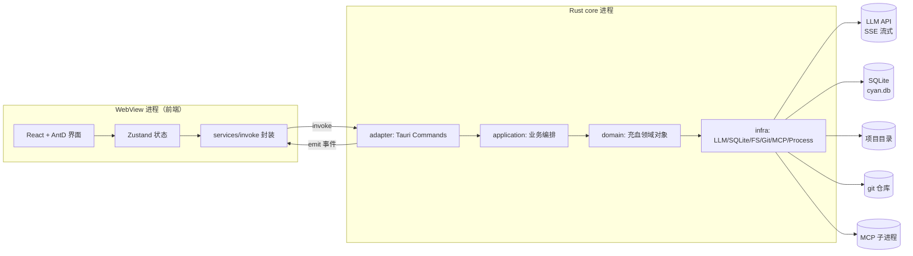

# cyan 技术方案（TECH_DESIGN）

| 项目 | 内容 |
| --- | --- |
| 版本 | v1.0.0 |
| 技术栈 | Rust（core）+ Tauri v2（壳）+ React 18 + TypeScript + Ant Design 5（UI） |
| 关联文档 | `docs/1.0.0/PRD.md` |
| 原型 | `docs/1.0.0/prototype/index.html` |

## 1. 总体架构

### 1.1 进程模型



- **不选 Electron**：Tauri v2 使用系统 WebView，安装包 < 20MB、内存占用低、Rust 原生能力（文件/git/子进程）无需 node 桥。
- 前端**不直接访问**文件系统与网络（LLM），一切能力经 `invoke` 进入 Rust core，保证权限引擎单点拦截。
- 流式输出、工具进度、审批请求等由 Rust 通过 **Tauri Event** 推送，前端订阅渲染。

### 1.2 DDBD 分层适配说明

本产品是单机桌面应用，无 HTTP 服务，DDBD 规范按如下映射执行，四层约束不变：

| DDBD 标准 | cyan 落地 |
| --- | --- |
| adapter（Controller） | `src-tauri/src/adapter/command/*_command.rs`：Tauri `#[tauri::command]` 入口 |
| Request / DTO | `src-tauri/src/adapter/dto/*_dto.rs`，serde 序列化给前端 |
| `/api/` 前缀 | 无 HTTP；命令命名统一动词开头（如 `list_sessions`），事件名统一 `<模块>:<动作>` |
| `/rpc/` + client 契约 | 无微服务，不引入 |
| application / domain / infra | 完全按 DDBD Rust 规范（见第 3 章） |

硬性继承：adapter 不碰 Repository/DO；查询必须过领域层；DO/Domain 不直接出 adapter，必须转 DTO；表必须有 `created_at` / `updated_at` / `deleted_at`；第三方 HTTP（LLM API）只在 infra 层并做协议适配。

## 2. 前端方案

### 2.1 技术选型

| 项 | 选择 | 说明 |
| --- | --- | --- |
| 框架 | React 18 + TypeScript | 函数组件 + Hooks |
| UI | Ant Design 5 | Table/Modal/Drawer/Tabs/Tag/Message，主题定制对齐原型视觉（圆角、渐变品牌色 `#1677ff → #722ed1`） |
| 状态 | Zustand | 会话、运行态、项目、配置多 store 拆分 |
| 路由 | react-router v6 | 单窗口内视图切换（聊天 / 设置可作为路由或 Modal，见 2.3） |
| 请求 | 自封装 `invoke` service（替代 axios） | 统一错误处理、类型化 |
| 流式 | `@tauri-apps/api/event` 订阅 | LLM chunk / 工具状态 / 审批请求 |
| 构建 | Vite 5 | 与 Tauri v2 模板一致 |

### 2.2 目录结构

```text
src/
├── main.tsx
├── App.tsx
├── routes/index.tsx            # 路由表
├── pages/
│   ├── chat/                   # 会话主视图（三栏布局）
│   │   ├── index.tsx
│   │   ├── components/         # 视图内组件
│   │   └── hooks/
├── components/
│   ├── message/                # UserBubble / AssistantText / ToolCard / DiffView / ApprovalCard / SystemDivider
│   ├── session/                # SessionList / SessionItem
│   ├── filetree/               # FileTree / FileNode
│   ├── project/                # ProjectModal（打开/新建两个 Tab）
│   ├── settings/               # SettingsModal + ModelsTab / McpTab / PermsTab / AboutTab
│   ├── drawer/                 # TaskDrawer（TODO + 变更列表）
│   └── common/                 # ConfirmModal / FormModal / Empty / PageHeader
├── services/
│   ├── invoke.ts               # invoke 封装：泛型 + 错误码归一
│   ├── session.ts              # 会话相关命令
│   ├── agent.ts                # 任务发送/中断/审批 + 事件订阅
│   ├── project.ts              # 项目 CRUD
│   ├── config.ts               # 模型/MCP/权限规则 CRUD
│   └── file.ts                 # 文件树/预览
├── stores/
│   ├── sessionStore.ts         # 会话列表、当前会话、消息流
│   ├── agentStore.ts           # running/waiting_approval、todos、changes、token/ctx
│   ├── projectStore.ts         # 当前项目、最近项目
│   └── configStore.ts          # 模型、MCP、权限规则、权限模式
├── types/                      # 与 adapter DTO 一一对应的 TS 类型
├── utils/                      # glob 展示、时间格式化、emoji 分配
└── theme.ts                    # AntD ConfigProvider 主题 token
```

### 2.3 视图与路由

桌面单窗口，路由仅两级：

| 路径 | 视图 | 说明 |
| --- | --- | --- |
| `/` | 重定向 `/chat` | - |
| `/chat` | 会话主视图 | 三栏布局；会话 id 走 query `?s=<id>` 保证刷新恢复 |
| `*` | 404 → `/chat` | - |

设置、项目、文件预览、diff、确认均为 Modal/Drawer，不占路由。

### 2.4 关键状态设计

| Store | 关键状态 | 页面状态覆盖 |
| --- | --- | --- |
| sessionStore | `sessions` / `activeId` / `messages` / `searchKw` | 空态、加载态、选中态、删除确认 |
| agentStore | `runState: idle/running/waiting_approval` / `todos` / `changes` / `ctx` / `tokens` / `pendingApproval` | 运行中禁用项、审批卡、上下文条 warn |
| projectStore | `current` / `recents` | 切换 loading、弹窗表单 dirty 校验 |
| configStore | `models` / `mcpServers` / `permRules` / `permMode` / `activeModel` | 表格分页/筛选、禁用行、默认保护 |

消息流渲染：`react-virtuoso` 虚拟列表（长会话不卡）；流式 chunk 以 token 级频率更新末尾消息，用 `requestAnimationFrame` 节流合并。

### 2.5 API 调用约定（services 层）

```ts
// services/invoke.ts：统一封装，错误码归一后抛 ServiceError
export async function call<T>(cmd: string, args?: object): Promise<T>;

// services/agent.ts 示例
export const sendTask = (sessionId: string, text: string) =>
  call<void>('send_task', { request: { sessionId, text } });

// 事件订阅（agentStore 初始化时注册）
listen<AgentEvent>('agent:event', (e) => agentStore.getState().onAgentEvent(e.payload));
```

错误处理：`ServiceError.code` 映射 `message.error`；`LLM_TIMEOUT` 等可重试错误在 service 内指数退避 3 次后再抛。刷新策略：表格类操作成功后重新 `call` 列表接口，不做前端乐观更新。

### 2.6 表单与表格

- 表单：AntD `Form` + 规则与 PRD 第 7 章一致；提交前转换（`contextWindow` 转 number、`apiKey` 空串转 `undefined` 表示不修改）。
- 表格：列定义含状态 Tag 渲染、行内操作（编辑/设为默认/删除）、`pagination={{ pageSize: 5, showTotal }}`、搜索受控重置页码、空态 `locale.emptyText`。
- 组件拆分：页面组件只编排；业务弹窗（ModelFormModal/McpFormModal/PermRuleFormModal）复用 `FormModal` 壳；`useTableCrud` hook 封装 加载/增删改/刷新。

## 3. Rust core 方案（DDBD 四层）

### 3.1 目录结构

```text
src-tauri/
├── Cargo.toml
├── tauri.conf.json
└── src/
    ├── main.rs                      # 启动：Builder、插件、命令注册、状态注入
    ├── adapter/
    │   ├── command/                 # Tauri command 入口（Controller 角色）
    │   │   ├── session_command.rs
    │   │   ├── agent_command.rs
    │   │   ├── project_command.rs
    │   │   ├── config_command.rs
    │   │   └── file_command.rs
    │   ├── dto/                     # Request / DTO + From 转换
    │   └── event.rs                 # 推送到前端的事件定义（AgentEvent 等）
    ├── application/
    │   ├── agent_service/           # AgentService：任务编排、审批流转
    │   ├── session_service/         # SessionService：会话与消息
    │   ├── project_service/         # ProjectService：项目与脚手架
    │   └── config_service/          # ConfigService：模型/MCP/权限规则
    ├── domain/
    │   ├── agent/                   # AgentRun、ToolCall、ApprovalDecision、PermissionEngine
    │   ├── session/                 # Session、Message（充血：追加消息、compaction 判定）
    │   ├── project/                 # Project（路径校验、模板）
    │   ├── config/                  # ModelConfig、McpServer、PermissionRule
    │   └── shared/                  # 值对象：ProjectPath、GlobPattern
    └── infra/
        ├── llm/                     # LLM client：OpenAI 兼容 SSE / Anthropic，协议适配
        ├── db/                      # SQLx + SQLite：datasource.rs + <biz>_repo/
        ├── fs/                      # 文件树读取、路径逃逸校验、文件预览
        ├── git/                     # git2：checkpoint 快照与回滚
        ├── mcp/                     # MCP 子进程（stdio 握手、工具发现）
        └── process/                 # Bash 执行：tokio::process + 超时 + 取消
```

### 3.2 涉及对象清单

| 模块 | Request | DTO | Cmd | Query | BO | Domain | Repository (trait) | DO |
| --- | --- | --- | --- | --- | --- | --- | --- | --- |
| 会话 | `SendTaskRequest` `CreateSessionRequest` `DeleteSessionRequest` `ListSessionRequest` | `SessionDTO` `MessageDTO` `SessionSummaryDTO` | `CreateSessionCmd` `DeleteSessionCmd` `AppendMessageCmd` | `ListSessionQuery` | `SessionBO` `MessageBO` | `Session` `Message` | `SessionRepository` `MessageRepository` | `SessionDO` `MessageDO` |
| Agent | `ApproveRequest` `InterruptRequest` `SetPermModeRequest` | `AgentEventDTO`（事件载荷） `TodoDTO` `ChangeDTO` | `StartRunCmd` `ApproveCmd` `InterruptCmd` | - | `RunBO` | `AgentRun` `ToolCall` `Approval` `PermissionEngine` | （运行态在内存，不持久化） | - |
| 项目 | `OpenProjectRequest` `CreateProjectRequest` `RecentProjectRequest` | `ProjectDTO` | `OpenProjectCmd` `CreateProjectCmd` | `RecentProjectQuery` | `ProjectBO` | `Project` `ProjectTemplate` | `ProjectRepository` | `ProjectDO` |
| 模型 | `SaveModelRequest` `DeleteModelRequest` `SetDefaultModelRequest` `ListModelRequest` | `ModelDTO` | `SaveModelCmd` `DeleteModelCmd` `SetDefaultModelCmd` | `ListModelQuery` | `ModelBO` | `ModelConfig` | `ModelRepository` | `ModelDO` |
| MCP | `SaveMcpRequest` `ToggleMcpRequest` `DeleteMcpRequest` `ListMcpRequest` | `McpServerDTO` | `SaveMcpCmd` `ToggleMcpCmd` `DeleteMcpCmd` | - | `McpServerBO` | `McpServer` | `McpRepository` | `McpServerDO` |
| 权限规则 | `SavePermRuleRequest` `DeletePermRuleRequest` `ListPermRuleRequest` | `PermRuleDTO` | `SavePermRuleCmd` `DeletePermRuleCmd` | - | `PermRuleBO` | `PermissionRule` | `PermRuleRepository` | `PermRuleDO` |
| 文件 | `FileTreeRequest` `FilePreviewRequest` | `FileNodeDTO` `FilePreviewDTO` | - | `FileTreeQuery` | `FileNodeBO` | （只读服务，无写行为） | - | - |

转换全部使用显式 `From`/`TryFrom`，放置位置遵守 DDBD：adapter/dto 内做 `Request→Cmd`、`BO→DTO`；application 内做 `Cmd→Domain`、`Domain→BO`；infra repo 内做 `DO↔Domain`。所有 Domain/BO/DTO/Cmd/Query/DO 字段带中文 `///` 注释。

### 3.3 领域行为归属（充血）

- `Session`：`append_message()`（消息序号自洽）、`should_compact(ctx_threshold)`、`compact()`（保留用户消息与结论摘要）。
- `AgentRun`：`start()` / `request_approval(call)` / `approve(decision)` / `interrupt()`（CancellationToken 触发、悬置审批以 `abort` 决断）/ `finish()`。
- `PermissionEngine`：`decide(tool, target) -> Allow | Ask | Deny`，规则自上而下匹配，deny 优先；内置 deny 清单（`.env*`、`id_rsa*`、`rm -rf / *`）。
- `PermissionRule::always_allow_from(tool, target)`：审批「总是允许」自动推导规则 pattern。
- `ModelConfig`：`normalize()`（baseUrl 去尾斜杠）、`validate()`（PRD 7.1 规则）、`mask_key()`（`sk-****xxxx`）。
- `Project`：`validate_path()`（存在性 + canonicalize）、`scaffold(template)`、`ensure_git()`。
- `McpServer`：`connect()` / `disable()` / `mark_error(reason)` 状态流转。

## 4. 接口清单（Tauri Commands 与事件）

### 4.1 Command 清单

| Command | 参数（Request） | 返回（DTO） | 用途 | 幂等 |
| --- | --- | --- | --- | --- |
| `list_sessions` | `ListSessionRequest{ projectPath, keyword? }` | `Vec<SessionSummaryDTO>` | 会话列表/搜索 | 是 |
| `get_session` | `{ sessionId }` | `SessionDTO`（含全部 MessageDTO） | 打开会话 | 是 |
| `create_session` | `CreateSessionRequest{ projectPath }` | `SessionDTO` | 新建会话 | 否 |
| `delete_session` | `DeleteSessionRequest{ sessionId }` | `()` | 删除会话（软删） | 是 |
| `send_task` | `SendTaskRequest{ sessionId, text, model, permMode }` | `()`（结果走事件） | 发起 Agent 任务 | 否（前端运行中禁用） |
| `interrupt_run` | `InterruptRequest{ sessionId }` | `()` | 中断当前运行 | 是 |
| `approve` | `ApproveRequest{ sessionId, callId, decision }` | `()` | 审批（once/always/reject） | 是（重复审批返回已决断） |
| `list_projects` | - | `Vec<ProjectDTO>` | 最近项目 | 是 |
| `open_project` | `OpenProjectRequest{ path }` | `ProjectDTO` | 指定文件夹为项目 | 是 |
| `create_project` | `CreateProjectRequest{ name, parent, template, gitInit }` | `ProjectDTO` | 新建项目（脚手架） | 否（重名校验拦截） |
| `file_tree` | `FileTreeRequest{ projectPath }` | `Vec<FileNodeDTO>` | 文件树（懒加载按目录） | 是 |
| `file_preview` | `FilePreviewRequest{ projectPath, relPath }` | `FilePreviewDTO{ content, truncated }` | 文件预览（≤ 64KB） | 是 |
| `rollback_change` | `{ sessionId, changeId }` | `()` | checkpoint 回滚 | 是 |
| `list_models` / `save_model` / `delete_model` / `set_default_model` | 见对象清单 | `Vec<ModelDTO>` / `ModelDTO` / `()` / `()` | 模型配置 CRUD | save 按 name 幂等 |
| `list_mcp_servers` / `save_mcp_server` / `toggle_mcp_server` / `delete_mcp_server` | 见对象清单 | 同型 | MCP CRUD；save 含握手验证 | toggle/delete 幂等 |
| `list_perm_rules` / `save_perm_rule` / `delete_perm_rule` | 见对象清单 | 同型 | 权限规则 CRUD | 是 |

统一约定：所有命令错误返回 `Err(ServiceError)`，serde 序列化为 `{ code, message }`；adapter 只做 Request→Cmd、调用 Service、BO→DTO，不写业务。

### 4.2 事件清单（Rust → 前端，`agent:event` 单通道 + 类型判别）

| 事件 type | 载荷 | 时机 |
| --- | --- | --- |
| `text_delta` | `{ sessionId, delta }` | LLM 流式文本 |
| `tool_start` | `{ sessionId, callId, tool, arg }` | 工具开始执行 |
| `tool_end` | `{ sessionId, callId, status, output, note }` | 工具完成/失败 |
| `approval_required` | `{ sessionId, callId, tool, arg, reason }` | 需要审批 |
| `approval_resolved` | `{ sessionId, callId, decision }` | 审批结束（含 auto 批准） |
| `todo_update` | `{ sessionId, todos }` | TODO 推进 |
| `change_add` | `{ sessionId, change }` | 产生文件变更（checkpoint） |
| `ctx_update` | `{ sessionId, ctxPercent, tokens }` | 上下文/token 统计 |
| `compacted` | `{ sessionId, summary }` | 自动压缩完成 |
| `run_end` | `{ sessionId, result: done/aborted/error, usage }` | 运行结束 |

Request/DTO 示例：

```jsonc
// send_task 入参 SendTaskRequest
{ "sessionId": "s101", "text": "帮我修复 approval 的中断 bug", "model": "kimi-k2.5", "permMode": "ask" }

// SessionSummaryDTO
{ "id": "s1", "title": "修复审批回调的中断 bug", "group": "今天", "ctx": 62,
  "tokens": { "input": 48210, "output": 6213 },
  "createdAt": "2026-08-27 13:02:11", "updatedAt": "2026-08-27 13:20:03" }

// ToolCall 工具卡 DTO
{ "callId": "c8", "tool": "Edit", "arg": "src/agent/approval.ts", "status": "ok",
  "outputType": "diff", "output": "@@ -1,6 +1,10 @@\n ...", "note": "+3 / -1" }
```

## 5. 数据模型（SQLite）

库文件 `~/.cyan/cyan.db`，SQLx 迁移管理。所有表含 `created_at`、`updated_at`、`deleted_at`（软删）与 `created_by`、`updated_by`（单机默认 `'local'`，保留字段为将来账号体系预留）；查询一律过滤 `deleted_at IS NULL`；时间统一 `chrono::NaiveDateTime`，存储 `YYYY-MM-DD HH:MM:SS`。

```sql
CREATE TABLE cyan_project (
  id          INTEGER PRIMARY KEY AUTOINCREMENT,
  name        TEXT NOT NULL,                 -- 项目名
  path        TEXT NOT NULL,                 -- 绝对路径（canonicalize 后）
  last_opened_at TEXT,                       -- 最近打开时间
  created_by  TEXT NOT NULL DEFAULT 'local', -- 创建人
  updated_by  TEXT NOT NULL DEFAULT 'local', -- 更新人
  created_at  TEXT NOT NULL,                 -- 创建时间
  updated_at  TEXT NOT NULL,                 -- 更新时间
  deleted_at  TEXT,                          -- 删除时间（软删）
  UNIQUE (path)
);

CREATE TABLE cyan_session (
  id          INTEGER PRIMARY KEY AUTOINCREMENT,
  project_id  INTEGER NOT NULL REFERENCES cyan_project(id),
  title       TEXT NOT NULL DEFAULT '新会话', -- 会话标题（首条任务截断生成）
  ctx_percent INTEGER NOT NULL DEFAULT 0,    -- 上下文占用百分比
  input_tokens  INTEGER NOT NULL DEFAULT 0,  -- 累计输入 token
  output_tokens INTEGER NOT NULL DEFAULT 0,  -- 累计输出 token
  created_by  TEXT NOT NULL DEFAULT 'local',
  updated_by  TEXT NOT NULL DEFAULT 'local',
  created_at  TEXT NOT NULL,
  updated_at  TEXT NOT NULL,
  deleted_at  TEXT
);
CREATE INDEX idx_session_project ON cyan_session(project_id, deleted_at, updated_at DESC);

CREATE TABLE cyan_message (
  id          INTEGER PRIMARY KEY AUTOINCREMENT,
  session_id  INTEGER NOT NULL REFERENCES cyan_session(id),
  seq         INTEGER NOT NULL,              -- 会话内序号
  kind        TEXT NOT NULL,                 -- user/assistant/tool/approval/system
  payload     TEXT NOT NULL,                 -- JSON：文本或工具卡/审批卡结构
  created_by  TEXT NOT NULL DEFAULT 'local',
  updated_by  TEXT NOT NULL DEFAULT 'local',
  created_at  TEXT NOT NULL,
  updated_at  TEXT NOT NULL,
  deleted_at  TEXT,
  UNIQUE (session_id, seq)
);

CREATE TABLE cyan_model_config (
  id          INTEGER PRIMARY KEY AUTOINCREMENT,
  name        TEXT NOT NULL,                 -- 模型名，唯一
  provider    TEXT NOT NULL,                 -- Provider
  base_url    TEXT NOT NULL,                 -- Base URL
  api_key     TEXT NOT NULL,                 -- API Key（OS keychain 存储，库内放引用串）
  context_window INTEGER NOT NULL,           -- 上下文窗口
  is_default  INTEGER NOT NULL DEFAULT 0,    -- 是否默认（应用层保证唯一）
  status      TEXT NOT NULL DEFAULT 'enabled', -- enabled/disabled
  created_by  TEXT NOT NULL DEFAULT 'local',
  updated_by  TEXT NOT NULL DEFAULT 'local',
  created_at  TEXT NOT NULL,
  updated_at  TEXT NOT NULL,
  deleted_at  TEXT,
  UNIQUE (name)
);

CREATE TABLE cyan_mcp_server (
  id          INTEGER PRIMARY KEY AUTOINCREMENT,
  name        TEXT NOT NULL,                 -- 服务器名，唯一
  command     TEXT NOT NULL,                 -- 启动命令
  status      TEXT NOT NULL DEFAULT 'disabled', -- connected/error/disabled
  tools       INTEGER NOT NULL DEFAULT 0,    -- 握手发现的工具数
  last_error  TEXT,                          -- 最近失败原因
  created_by  TEXT NOT NULL DEFAULT 'local',
  updated_by  TEXT NOT NULL DEFAULT 'local',
  created_at  TEXT NOT NULL,
  updated_at  TEXT NOT NULL,
  deleted_at  TEXT,
  UNIQUE (name)
);

CREATE TABLE cyan_permission_rule (
  id          INTEGER PRIMARY KEY AUTOINCREMENT,
  tool        TEXT NOT NULL,                 -- 工具名
  pattern     TEXT NOT NULL,                 -- glob 匹配模式
  action      TEXT NOT NULL,                 -- allow/ask/deny
  sort        INTEGER NOT NULL DEFAULT 0,    -- 匹配顺序（自上而下）
  created_by  TEXT NOT NULL DEFAULT 'local',
  updated_by  TEXT NOT NULL DEFAULT 'local',
  created_at  TEXT NOT NULL,
  updated_at  TEXT NOT NULL,
  deleted_at  TEXT,
  UNIQUE (tool, pattern)
);

CREATE TABLE cyan_checkpoint (
  id          INTEGER PRIMARY KEY AUTOINCREMENT,
  session_id  INTEGER NOT NULL REFERENCES cyan_session(id),
  file_path   TEXT NOT NULL,                 -- 变更文件（相对项目）
  git_ref     TEXT NOT NULL,                 -- checkpoint 对应的 git stash/tree 引用
  add_lines   INTEGER NOT NULL DEFAULT 0,    -- 新增行数
  del_lines   INTEGER NOT NULL DEFAULT 0,    -- 删除行数
  rolled_back INTEGER NOT NULL DEFAULT 0,    -- 是否已回滚
  created_by  TEXT NOT NULL DEFAULT 'local',
  updated_by  TEXT NOT NULL DEFAULT 'local',
  created_at  TEXT NOT NULL,
  updated_at  TEXT NOT NULL,
  deleted_at  TEXT
);
```

## 6. 核心机制设计

### 6.1 Agent Loop（tokio）

```text
send_task → AgentService::start_run(cmd)
  → 校验会话 idle + 项目存在 → AgentRun::start()
  → loop {
      llm.stream(messages, tools, cancel_token)        // infra/llm，SSE chunk → emit text_delta
      无 tool_call → emit run_end(done)，退出
      有 tool_call → PermissionEngine.decide()
        Allow → 执行
        Ask   → emit approval_required，挂起 oneshot::channel 等待 approve 命令
        Deny  → 结果回写 messages，继续 loop
      执行工具（Edit 成功后 infra/git 打 checkpoint，emit change_add）
      结果 push messages，更新 ctx/tokens → emit ctx_update
      ctx ≥ 90% → Session::compact() → emit compacted
    }
```

- **中断**：`interrupt_run` 触发 `CancellationToken`；SSE 流、子进程（`tokio::process::Child::kill`）、悬置的审批 oneshot 统一以 `abort` 决断收尾，emit `run_end(aborted)`。Promise 悬置类 bug 在设计上杜绝：所有等待点都必须选挂 `cancel_token`。
- **审批**：`approval_required` 事件携带 `callId`；前端 `approve` 命令经 `ApproveCmd` 找回对应 oneshot sender 投递决断；超时（默认 10 分钟）自动按 reject 处理。
- **自动模式**：decide 为 Ask 且无 deny 命中时直接记录 `auto` 决断并继续，同时 emit `approval_resolved(auto)` 供前端展示。

### 6.2 权限引擎

```text
decide(tool, target):
  1. 内置 deny 清单命中 → Deny               # .env*、id_rsa*、rm -rf /* 等，不可覆盖
  2. 用户规则自上而下（sort 升序）首个 glob 命中 → 其 action
  3. 写类工具（Edit/Write/Bash）默认 → Ask；只读工具默认 → Allow
  plan 模式：写类工具一律 Deny（连同 allow 规则一起压制）
```

### 6.3 Checkpoint 与回滚

Edit/Write 工具执行**前**，infra/git（git2 crate）对目标文件记录 `git stash create` 树引用写入 `cyan_checkpoint.git_ref`；回滚 = 检出该引用覆盖工作区文件并置 `rolled_back=1`。非 git 项目：先 `git init` + 空提交基线，新建项目模板默认勾选 git init 即为此服务。

### 6.4 上下文压缩（compaction）

`Session::should_compact()` 在 ctx ≥ 90% 触发：将最早 60% 的消息送 LLM 生成结构化摘要（保留：用户原始诉求、已做决定、改动文件清单），替换为一条 `kind=system` 摘要消息；用户消息与最近 40% 原样保留。摘要与 usage 落库，前端上下文条回落。

### 6.5 MCP 接入

infra/mcp 使用 stdio 拉起子进程，完成 `initialize` 握手与 `tools/list` 发现；发现的工具以 `mcp__<server>__<tool>` 命名注入当次 Agent 运行的工具表，权限引擎将其视为普通工具（默认 Ask）。状态机 `disabled → connecting → connected / error`；error 携带 `last_error` 并在下次运行自动跳过。

### 6.6 安全

- 文件与命令统一走 `ProjectPath::resolve()`：canonicalize 后必须仍以项目根为前缀，否则拒绝（防 `../` 逃逸、防绝对路径越权）。
- Bash 命令记录审计日志 `~/.cyan/logs/audit.log`（命令、决断、退出码、耗时）。
- API Key 存 `~/.cyan/keys.json`（权限 0600，仅当前用户可读写），SQLite 仅存引用串；DTO 输出一律 `mask_key()`。注：原设计为 OS keychain，但 macOS 数据保护 keychain 将条目绑定到创建它的二进制，adhoc 签名每次构建都变导致重建后读取失败，开发期改用文件存储；正式发布签名后可切回 keychain。
- 前端 CSP：Tauri 配置禁用远程资源加载，仅本地 asset。

## 7. 联调约定

| 项 | 约定 |
| --- | --- |
| 错误码 | `0` 成功；`1xxx` 参数/校验错（前端字段级展示）；`2xxx` 业务错（运行冲突、重名、默认保护）；`3xxx` 外部依赖错（LLM/MCP/git）；`9001` 未授权操作（deny 命中） |
| 分页 | `{ page, pageSize }` 入，`{ list, total, page, pageSize }` 出；页码从 1 开始 |
| 时间 | 存储与传输统一 `YYYY-MM-DD HH:MM:SS`（本地时区）；前端展示相对时间 |
| 事件命名 | 单通道 `agent:event` + `type` 判别；配置变更走 `config:changed` |
| 文件预览 | 单文件 ≤ 64KB，超出 `truncated=true`；二进制文件拒绝预览 |
| 导入导出（增强） | 会话导出为 Markdown，含工具卡折叠块 |

## 8. 构建、打包与可观测

- 依赖基线：`tauri 2.x`、`tokio`、`sqlx(sqlite, runtime-tokio)`、`reqwest(rustls, stream)`、`serde`、`async-trait`、`anyhow`、`thiserror`、`chrono`、`git2`、`keyring`、`tracing`、`globset`。
- `tauri.conf.json`：窗口 1280×800 最小 960×600；CSP 收紧；`updater` 插件接 GitHub Releases 做自动更新；macOS 公证、Windows 签名走 CI。
- 日志：`tracing` + `tracing-appender`，按天滚动存 `~/.cyan/logs/`；每次 LLM 调用记录 model、token 用量、耗时（不含 prompt 内容，隐私默认关闭，可在设置开启调试日志）。
- 测试：domain 层纯函数单测（权限引擎、compaction 判定、路径校验）；repo 层 `sqlx::test` 内存库；application 层 mock Repository；前端 vitest + Testing Library 覆盖 store 与表单校验。
- 发版检查：三平台（macOS arm64/x64、Windows x64、Linux x64）UI 走查 + PRD 第 11 章验收项全过。
